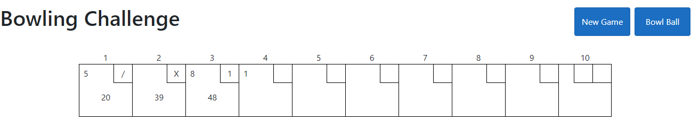

# Bowling

React/Typescript with .NET CORE (NUnit Tests)

## Dependencies

Nodejs - https://nodejs.org/

## Application Functions

"New Game" - Reset the UI and clears the memory cache that stores any existing frames 
"Bowl Ball" - Bowls one ball and on return the UI frames will update 
"Play Again" - At the end of the game, this will reset the UI and clear the memory cache 

## Game Breakdown

By bowling with the button "Bowl Ball", pins are knocked down randomly between 0 and max pins remaining on the frame.

